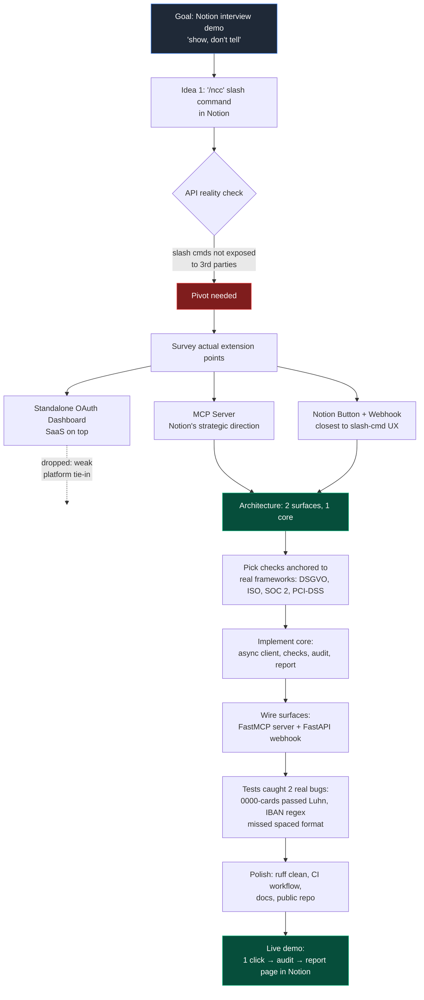

# How this got built — the decision journey

> A condensed walkthrough of the choices behind NCC, written so it doubles as a video script. The interesting story is not "I wrote Python that calls an API" — it's the chain of small architectural decisions that shaped the result.

## TL;DR

- **Started with a wrong assumption** (`/ncc` slash command in Notion) that the Notion API doesn't actually support.
- **Did the reality check** by reading the API reference instead of pushing forward blindly.
- **Pivoted to MCP + Notion Buttons** — the two extension points Notion is actually investing in.
- **Built two surfaces on one core**: an MCP server for agent-driven use, a webhook for one-click button use. Same checks, same report.
- **Total time: ~6 hours** from blank directory to public repo with passing CI.

---

## The decision journey

---

## Phase 1 — The wrong assumption (5 min)

**The original idea**: a Notion slash command. Type `/ncc` in any page, get a compliance audit dropped in.

That's a clean user experience and it's the first thing that comes to mind because Slack works that way. **Important question**: does Notion actually let third-party tools register slash commands?

I went to the API reference instead of pushing ahead.

**Answer**: no. The Notion `/`-menu is not a public extension point. There are no docs, no examples, no community packages doing it — because the door isn't open.

This is the moment the project either pivots or dies. Pushing forward would have produced something that *technically* runs but feels off-pattern in a Notion interview, which would have been worse than not building anything.

---

## Phase 2 — Surveying the actual extension points (15 min)

If `/ncc` isn't possible, what *is*? I listed everything Notion exposes for third-party developers and scored each against two criteria: (a) how close it gets to the original UX, and (b) how strategically aligned it is with where Notion is investing.

| Extension point | UX match | Strategic fit | Verdict |
|---|---|---|---|
| Slash command | 10/10 | — | Not available |
| MCP server | 7/10 (conversational) | **10/10** — Notion ships first-party MCP | ✅ Build on this |
| Notion Button → Webhook | 8/10 (one click in Notion) | 7/10 — newer feature, paid plans | ✅ Build on this too |
| Custom integration via REST API | 5/10 (external) | 6/10 — stable but not the future | Used as the underlying client |
| Standalone OAuth dashboard | 3/10 (separate app) | 4/10 — SaaS on top, not platform-deep | ❌ Drop |
| Zapier / Make middleware | 4/10 | 2/10 — adds dependency, not native | ❌ Drop |

The interesting decision: **build both top contenders, don't pick one**. They serve different moments — the agent-driven path (Claude / Notion AI calls a tool) and the human-driven path (click a button in a page). Same audit logic, same report format, two ways in. That's the architecture you saw in the README diagram.

---

## Phase 3 — Picking the checks (20 min)

Compliance is a wide field. With two days, I had to be honest about what's defensible in an interview and what's hand-wavy.

**Criteria for inclusion**:
1. Anchored to a named framework control (DSGVO article, ISO 27001 control ID, SOC 2 criterion). No "best practice" without a reference.
2. Detectable from data the integration can actually see (page properties, blocks, sharing state).
3. Real risk — something a compliance officer would actually care about.

That gave me four checks:

| Check | Why it matters | Why it's defensible |
|---|---|---|
| `public_access` | Highest-impact accidental risk on any Notion workspace | DSGVO Art. 32, SOC 2 CC6.1 — concrete controls |
| `orphaned_pages` | Accountability gap — no one owns the data | ISO 27001 A.5.2 — explicit role assignment |
| `stale_data` | Outdated personal data is a quiet, structural risk | DSGVO Art. 5(1)(d) — accuracy principle |
| `pii_exposure` | The one that needs real engineering | DSGVO Art. 9, PCI-DSS Req 3.4 |

The PII check is the one with the most depth: regex alone produces too much noise. I added Luhn validation for credit cards and mod-97 for IBANs, so the output is auditor-grade signal, not a noisy spreadsheet. That's the difference between something useful and something demo-ware.

---

## Phase 4 — Implementation order (3 h)

Order matters when you have a deadline. I built bottom-up so each layer was testable on its own:

1. **Async Notion client wrapper** — `httpx` + cursor-based pagination + 429 retry with `Retry-After`. The official `notion-client` SDK is sync-only, which kills audit time on real workspaces with hundreds of pages.
2. **`Check` base class + `Finding` dataclass** — the contract every check has to satisfy. Severity enum, framework references, deep-link back to Notion.
3. **The four checks** — each one isolated, async, returns `list[Finding]`. No shared state, no order dependency.
4. **`audit.py` orchestrator** — `asyncio.gather(..., return_exceptions=True)` so one failing check never aborts the audit. Score 0–100, weighted by severity.
5. **Report builder** — turns an `AuditResult` into Notion block JSON. Respects the platform's 100-children-per-request cap.
6. **Two surfaces** — FastMCP server (`stdio` + `streamable-http`) and FastAPI webhook with shared-secret auth.
7. **CLI** — last, because once the rest works, wrapping it in `argparse` + `rich` is mechanical.

This sequence means at every checkpoint I had something runnable. If the deadline collapsed at hour 4, I'd still have a working CLI demo, just no MCP/webhook surfaces yet.

---

## Phase 5 — What the tests caught (15 min)

The point of writing tests in a 2-day project isn't coverage theatre — it's catching the bugs you wouldn't notice in a happy-path demo. Two real ones surfaced immediately:

### Bug 1: `0000 0000 0000 0000` passed Luhn validation

Mathematically correct: a sequence of all zeros has a digit sum divisible by 10, so the Luhn algorithm accepts it. But it's obviously not a real card number — and a noisy compliance scan that flags every block of 16 zeros is worse than no scan.

**Fix**: reject inputs where all digits are identical, or where the leading digit is 0 (real Issuer Identification Numbers never start with 0).

### Bug 2: IBAN regex missed `DE89 3704 0044 0532 0130 00`

My initial regex was `\b[A-Z]{2}\d{2}[A-Z0-9]{11,30}\b` — clean for a contiguous IBAN, but real-world humans write IBANs in 4-character groups separated by spaces. The regex didn't match the spaced form, so we'd silently miss every bank statement copy-paste.

**Fix**: `\b[A-Z]{2}\d{2}(?:\s?[A-Z0-9]){11,38}\b` — optional whitespace between every character.

Both bugs only showed up because the tests used **real test values** (Visa test number `4539 1488 0343 6467`, IBAN test value `DE89 3704 0044 0532 0130 00`) instead of made-up strings. Worth remembering.

---

## Phase 6 — Polish (30 min)

The boring final lap, but disproportionately important when a recruiter is evaluating:

- **`ruff` lint clean** — no warnings, no `# noqa` shortcuts left in.
- **CI workflow** — runs tests + lint on Python 3.11 / 3.12 / 3.13 on every push.
- **README with an ASCII architecture diagram** — recruiters skim, the diagram has to convey the shape in 5 seconds.
- **Separate `architecture.md` and `notion-button-setup.md`** — README stays scannable, depth lives one click away.
- **Sample report file** — so anyone reading the README can see *what the output looks like* without running anything.
- **Public repo, MIT licensed, descriptive commit messages**.

---

## What I'd do differently

If this were going to production rather than a 2-day demo:

- **PII detection on rendered text, not raw blocks.** Today, an IBAN broken across a bold-styled run would be missed because each `rich_text` segment is scanned in isolation. A real version would render every block to a normalised string first.
- **Owner property detection by configuration, not heuristic.** Today I match against a hardcoded set of property names ("Owner", "Verantwortlich", etc.). Workspaces using `@responsible_engineer` are missed. v0.2 would let users map per-database which property counts as owner.
- **Sharing-graph diff.** Most compliance regressions are incremental — a page that was internal yesterday is shared with all today. A diff between snapshots catches that; a point-in-time audit doesn't.
- **Drop the shared-secret-in-body shim** the moment Notion adds signed webhooks. It works, but `hmac.compare_digest` over a secret in the body is a workaround, not a solution.

---

## The video script — 5 beats

If you're recording a Loom, this is the order:

1. **(15 s) The pitch.** "I built an MCP server that audits a Notion workspace for IT and company compliance — DSGVO, ISO 27001, SOC 2."
2. **(30 s) The pivot story.** Original idea was a slash command, API doesn't support it for third parties, pivoted to MCP + Buttons because that's where Notion's investing.
3. **(60 s) Live demo.** Click the Button in Notion → audit runs → new report page appears with severity-coded callouts and per-check toggles. Scroll through one critical finding, one PII finding.
4. **(45 s) Architecture in 4 sentences.** Two surfaces (MCP + webhook), one core (audit orchestrator + 4 checks). Async so a real workspace audits in seconds. Findings tied to specific framework controls, not vibes.
5. **(15 s) What's next.** Sharing-graph diff, custom check DSL, signed webhooks. End on the public repo URL.
